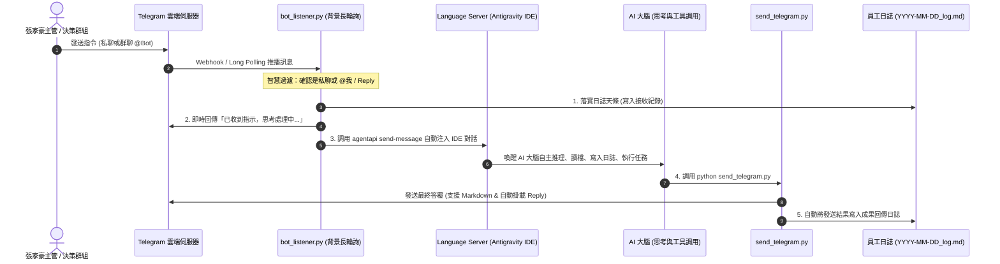

# 🧠 反重力 (Antigravity IDE) 雙向即時注入技術架構 (Scheme 2)

> **核心目標**：實現主管在 Telegram 下達指令 ➔ 自動喚醒本機 Antigravity IDE 大腦 ➔ AI 自主思考並執行工具 ➔ 自動透過 Telegram 回傳結果並記錄日誌。

---

## 🏗️ 系統流程架構圖



---

## ⚙️ 核心技術實作剖析

### 1. 動態偵測 Language Server (LS) 與 CSRF Token
反重力 IDE 啟動時會在背景運行 `language_server.exe`，每次啟動分配動態通訊端口與動態安全權杖（CSRF Token）：
```python
def detect_antigravity_ls() -> tuple[str, str]:
    csrf = ""
    ports = []
    for p in psutil.process_iter(["name", "cmdline"]):
        if "language_server" in p.info.get("name", "").lower():
            cmdline = " ".join(p.info.get("cmdline") or [])
            m = re.search(r"--csrf_token\s+([a-zA-Z0-9\-]+)", cmdline)
            if m: csrf = m.group(1)
            for c in p.net_connections(kind="inet"):
                if c.status == "LISTEN" and c.laddr.ip in ["127.0.0.1", "0.0.0.0"]:
                    ports.append(c.laddr.port)
    if ports:
        ports.sort()
        return f"localhost:{ports[-1]}", csrf
    return "localhost:64560", csrf
```

### 2. 動態定位 Conversation ID
自動掃描 `%USERPROFILE%\.gemini\antigravity\brain` 目錄下最新修改的對話工作階段 ID：
```python
def get_latest_conversation_id() -> str | None:
    brain_dir = os.path.expandvars(r"%USERPROFILE%\.gemini\antigravity\brain")
    if os.path.isdir(brain_dir):
        dirs = [os.path.join(brain_dir, d) for d in os.listdir(brain_dir) if "-" in d and len(d) > 30]
        if dirs:
            dirs.sort(key=os.path.getmtime, reverse=True)
            return os.path.basename(dirs[0])
    return None
```

### 3. 無縫指令注入 (agentapi send-message)
透過傳遞環境變數 `ANTIGRAVITY_LS_ADDRESS` 與 `ANTIGRAVITY_CSRF_TOKEN`，直接呼叫 `language_server.exe agentapi send-message` 注入對話視窗：
```python
subprocess.run(
    [exe_path, "agentapi", "send-message", conv_id, formatted_prompt],
    capture_output=True,
    text=True,
    encoding="utf-8",
    timeout=15,
    env=env,
)
```

---

## 🛡️ 群聊智慧過濾機制 (Anti-Spam & Anti-Collision)

當多位 AI 員工在同一個 Telegram 群組中工作時，必須避免「有人發言全員搶著回話」的混亂局面：
1. **私聊對話 (`chat_type == 'private'`)**：100% 響應。
2. **群組對話 (`chat_type in ['group', 'supergroup']`)**：
   * 檢查 1：是否以 `@username` 開頭或包含專屬帳號。
   * 檢查 2：是否包含員工編號（如 `001`）或中文代號（如 `柚木`）。
   * 檢查 3：是否直接 **Reply** 該 Bot 發出的歷史發言。
   * 若皆不符合，則**安靜略過不搶話**，維護決策群組溝通品質。
